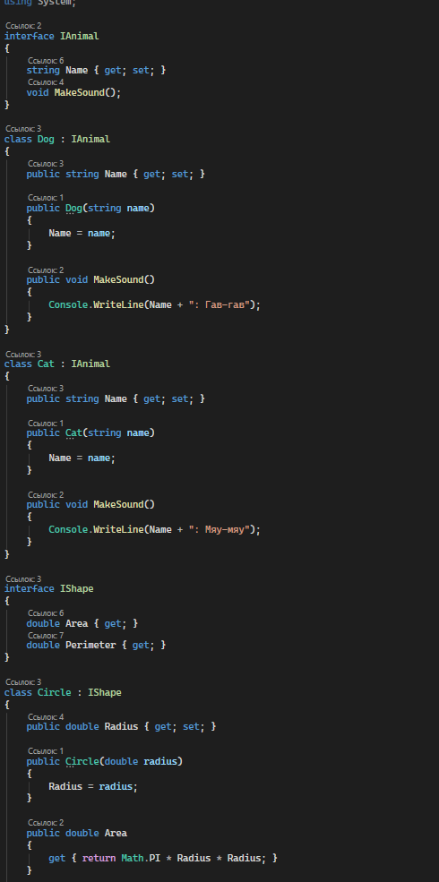
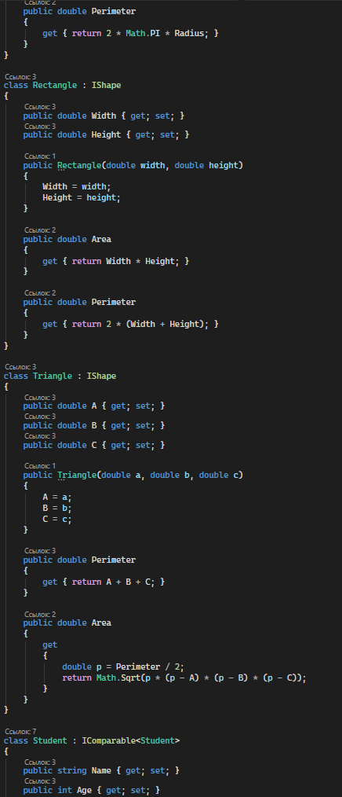
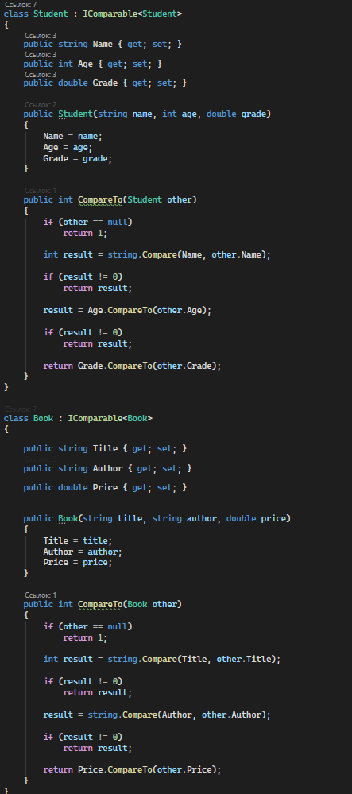
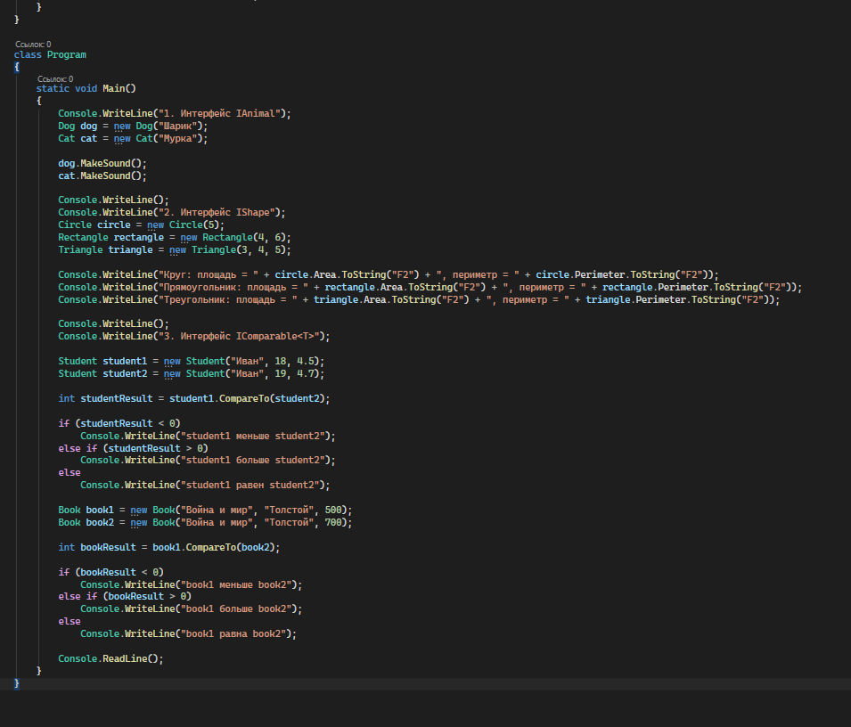
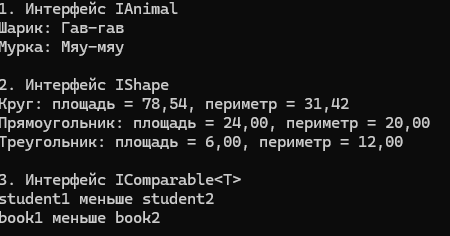

# C# KT5

1. Напишите интерфейс IAnimal, который содержит свойство Name и метод MakeSound. Затем напишите классы Dog и Cat, которые реализуют этот интерфейс и переопределяют метод MakeSound соответственно.

2. Напишите интерфейс IShape, который содержит свойства Area и Perimeter. Затем напишите классы Circle, Rectangle и Triangle, которые реализуют этот интерфейс и вычисляют свои площади и периметры по заданным параметрам.

3. Напишите интерфейс IComparable<T>, который содержит метод CompareTo(T other), который возвращает целое число, указывающее, как данный объект сравнивается с другим объектом того же типа. Затем напишите классы Student и Book, которые реализуют этот интерфейс и сравниваются по своим свойствам, таким как Name, Age, Grade, Title, Author и Price.

### Код

### Результат

